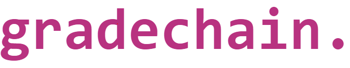{width="3.915203412073491in"
height="0.7604166666666666in"}

-   [Introduzione](#Introduzione)

-   [Struttura del blocco](#Struttura_Blocco)

-   [Funzionamento Programma](#Funzionamento_Programma)

    -   [Registrazione e Login](#Login)

    -   [Navigazione come Studente](#Navigazione_Studente)

        -   [Dashboard](#Dashboard_Studente)

        -   [Grades](#Grades_Studente)

        -   [Results](#Results_Studente)

        -   [Book Exams](#Book_Exams_studente)

    -   [Navigazione come Docente](#Navigazione_Docente)

        -   [Dashboard](#Dashboard_Docente)

        -   [Your Exams](#Your_Exams_Docente)

        -   [Verbalisation](#Verbalisation_Docente)

-   [Database](#Database)

-   [Conclusioni](#Conlusioni)

Jasprit Singh - 305884

&

Cipelli Lorenzo -- 305784

[Introduzione]

Le blockchain sono come dei "libri mastri" per immagazzinare
informazioni su transazioni. Questi dati sono raccolti all'interno di
blocchi, collegati uno all'altro, creando una catena di interconnessioni
immutabile. Un blocco viene reso valido da una firma che gli viene
assegnata, firma basata sul contenuto del blocco stesso e usata per i
collegamenti, questo implica che se il contenuto di un blocco dovesse
essere alterato la firma non sarebbe più corrispondente (per firma si
intende un digest prodotto da una funzione di hash). Questo da solo non
basta, la vera forza della blockchain sta nel fatto che un cambiamento
deve essere accettato dalla maggior parte degli utenti su di essa,
rendendo la contraffazione molto più difficile.

Per queste caratteristiche una blockchain può essere usata per
immagazzinare informazioni riguardanti qualsiasi campo, garantendo
immutabilità, di contro però le query diventeranno sempre più pesanti
nel tempo.

Tenendo conto di questa limitazioni introduciamo ciò intorno cui il
nostro progetto ruota: **Blockchain Database**.

Trattasi la nostra di una implementazione non decentralizzata che
facilita lo scenario di messa in funzione, grazie a questa struttura è
possibile avere dati disponibili per una futura analisi, come nel nostro
caso, essere mostrati all'interno di un registro elettronico.

Nel nostro caso i dati operazionali sono proprio i voti che i docenti
verbalizzano, possiamo allora facilemente capire che le transazioni sono
logicamente "unidirezionali", nel senso che vanno solo da docente a
studente, infatti è solo lo studente che può ricevere i voti e il
docente che può caricarli.

[Struttura del blocco]

Come già detto i blocchi sono collegati fra di loro grazie a delle firme
(digest) che vengono prodotti nel momento della validazione del blocco,
validazione che lo studente effettua accettando un voto che sia almeno
sufficiente (≥18).

All'interno del nostro blocco si troveranno:

-   **hash**: digest generato dando in pasto alla funzione di hash
    > SHA256 il previousHash, timestamp, nonce e merkleRoot delle
    > transazioni;

-   **previousHash**: serve per collegare il blocco alla blockchain, si
    > tratta dell'hash dell'ultimo blocco della catena, (sarà penultimo
    > dopo che il nuovo blocco sarà validato);

-   **timestamp**: data in formato Unix Timestamp, rappresenta quando il
    > blocco è creato;

-   **nonce**;

-   **merkleRoot**: digest (SHA256) originato dall'hashing delle
    > transazioni;

-   **transaction**: racchiude le transazioni del blocco, per semplicità
    > ad ogni voto assegnato corrisponde una transazione, nulla toglie
    > che con poco sforzo in futuro si potrebbe implementare più
    > transazioni per blocco (per esempio, all'interno del blocco
    > potrebbero essere immagazzinate tutte le informazioni riguardanti
    > la verbalizzazione di tutti i voti di un esame, e non una singola
    > verbalizzazione), per scopo didattico abbiamo preferito farlo
    > semplice;

I punto colorato in **viola** corrisponde alla firma del blocco, i punti
colorati in **verde** corrispondono all'headern del blocco, il punto in
**blu** corrisponde al body del blocco.

![Three blocks show some metadata and transactions. Each block contains
a hash. The following block has a field called prevHash linking back to
the previous
block.]
(assets/media/image3.png)

[Funzionamento Programma]

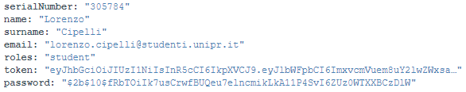
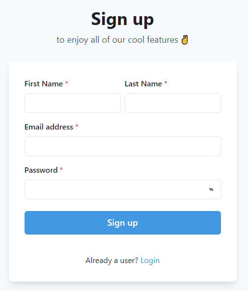

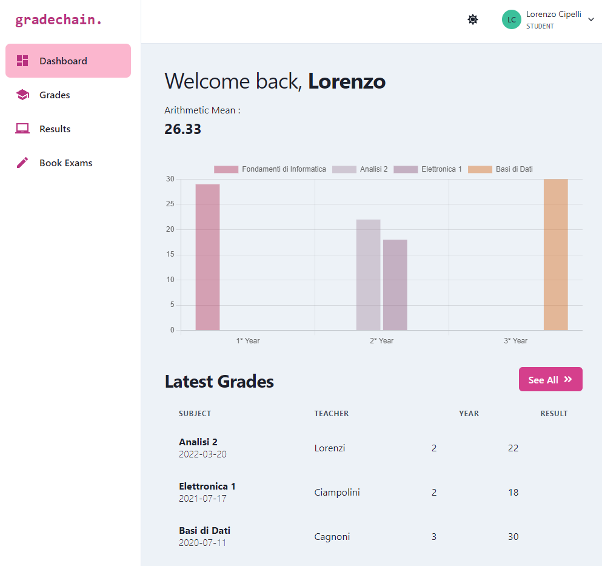
Navigazione come Studente

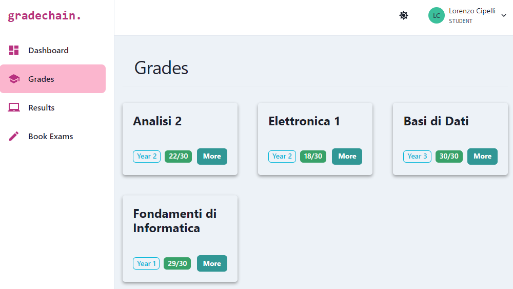

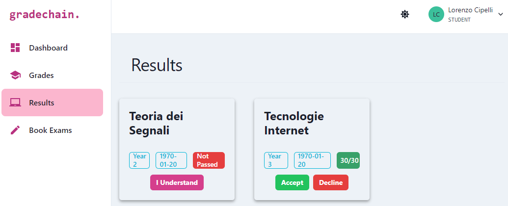
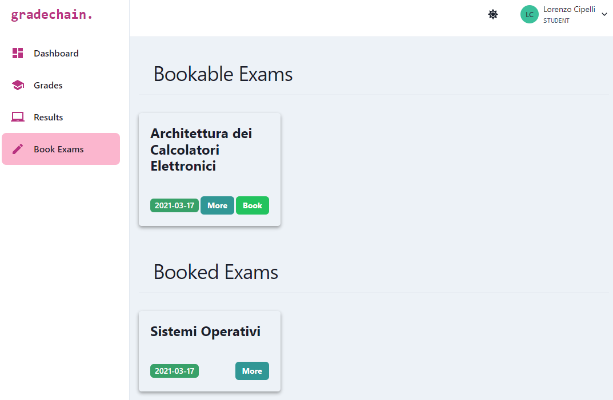

[]Navigazione come Docente

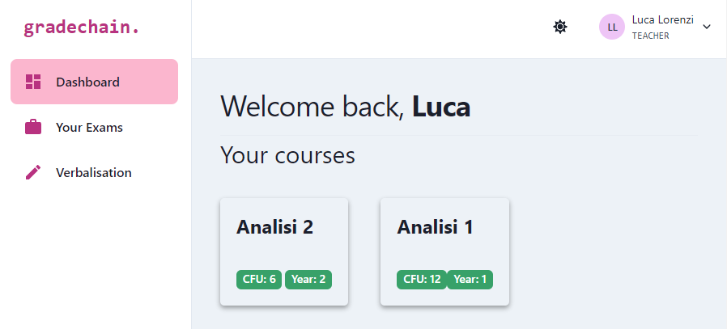

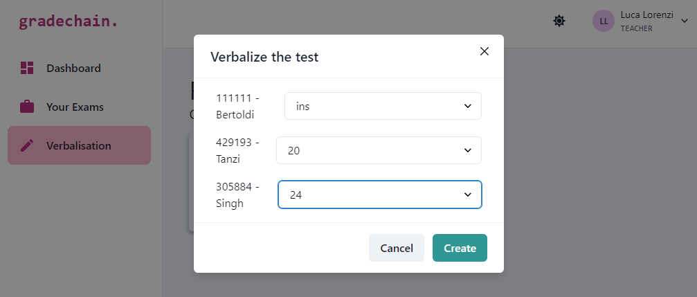

[Database]

In questo paragrafo saranno visitate le strutture della collections
usate per immagazzinare i dati del programma. Parliamo di collections in
quanto la piattaforma utilizzata è MongoDB, un DBMS NoSQL,
caratteristica che torna molto utile nel caso in cui ci sia da lavorare
con dei dati che possono mutare in forma garantendo elasticità (come per
esempio i docenti che insegnano una materia).

Le collections utilizzate sono state:

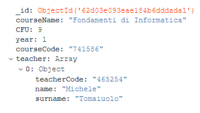
-   **courses**: collection utilizzata per
    immagazzinare i vari corsi disponibili e i professori che lo
    insegnano, questa struttura non verrà mai modificata nel corso del
    programma, dovrà essere l'amministratore del database ad entrare
    direttamente nel DBMS e modificare i documenti se si vorranno
    apportare modifiche;

-   **exam_subscriptions**: all'interno troviamo tutte le iscrizione di
    tutti gli studenti a diversi esami, le iscrizioni sono identificate
    univocamente dall'id del blocco e sono fondamentali per verbalizzare
    i voti e tenere contro del numero di iscrizioni ad un appello;

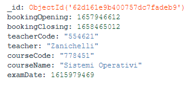
-   **exams**: troviamo tutti gli appelli di esami che sono al momento
    organizzati da ogni docente, possono esserci più appelli
    contemporaneamente della stessa materia;

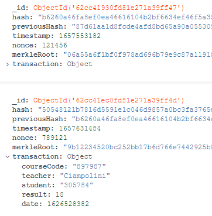
-   **grades**: questa è la vera e propria blockchain, come vediamo il
    blocco successivo (posizionato sotto) è legato a quello precedente
    (blocco sopra) tramite il previousHash, il resto della struttura è
    già stata ampiamente spiegata nella sezione di introduzione alle
    blockchain;

-   **pending_grades**: all'interno di questa collection sono salvati i
    blocchi che precedentemente abbiamo chiamato "temporanei" o
    "provvisori", sono le verbalizzazioni dei voti dei docenti, come
    spiegato più volte, questi blocchi potranno essere parte di un nuovo
    blocco in grades oppure essere scartate (in caso di rifiuto del voto
    o insufficienza), infatti si può notare che parte della struttura
    dei documenti di grades è esattamente quella dei documenti di
    pending_grades;

-   **users**: qua sono salvati sia gli studenti che i docenti con le
    informazioni di cui si è parlato per la registrazione più il token e
    il ruolo, anche in questo caso, se si vuole aggiungere un docente
    dovrà intervanire un amministratore del DBMS;

[Conclusioni]

Per il testing delle query in maniera sintetica è stato utilizzato
**Postman**, una piattaforma create appositamente per testare le API
sviluppate.

Lo sviluppo del progetto, nonostante la necessità di apprendimento
dell'uso di ambienti nuovi e moderni che ha richiesto tempo, è stato
parecchio stimolante. Questo progetto potrà essere espanso con
l'implementazione di un amministratore di sistema direttamente nel
programma e la gestione di più transazioni per ogni blocco.
